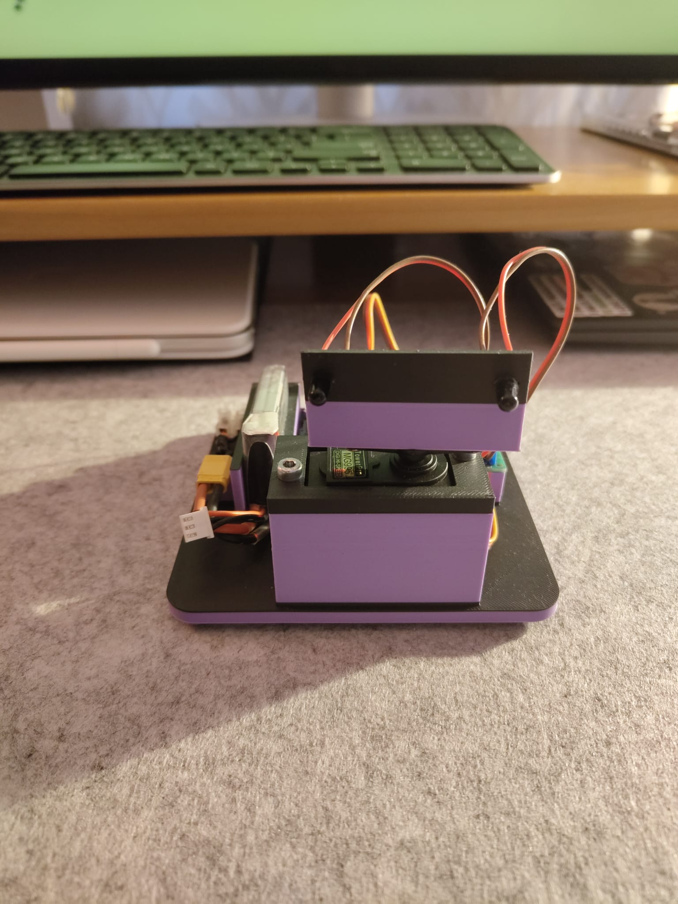
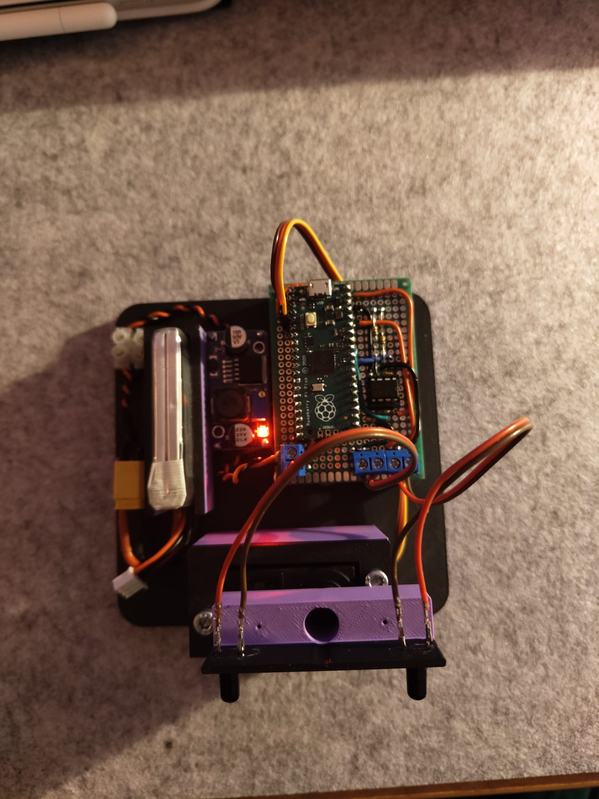
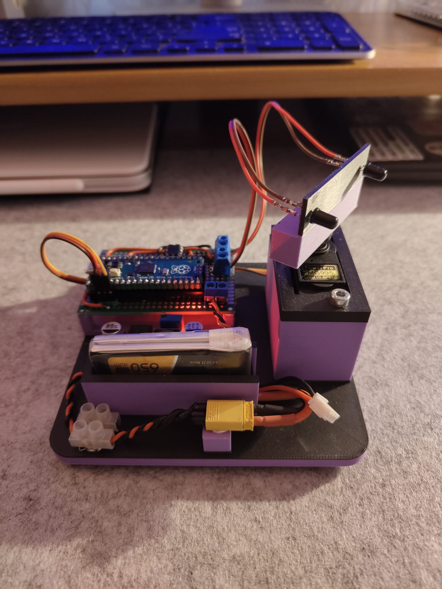
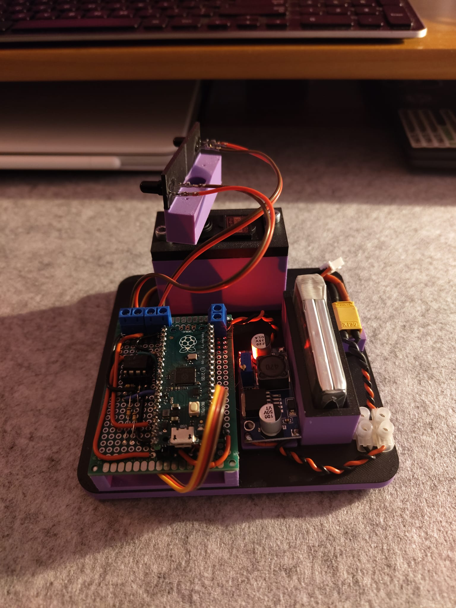
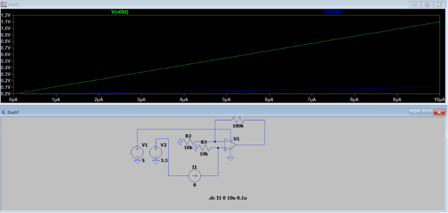
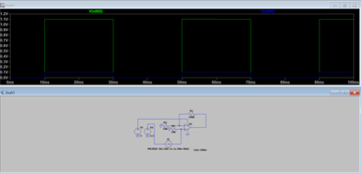
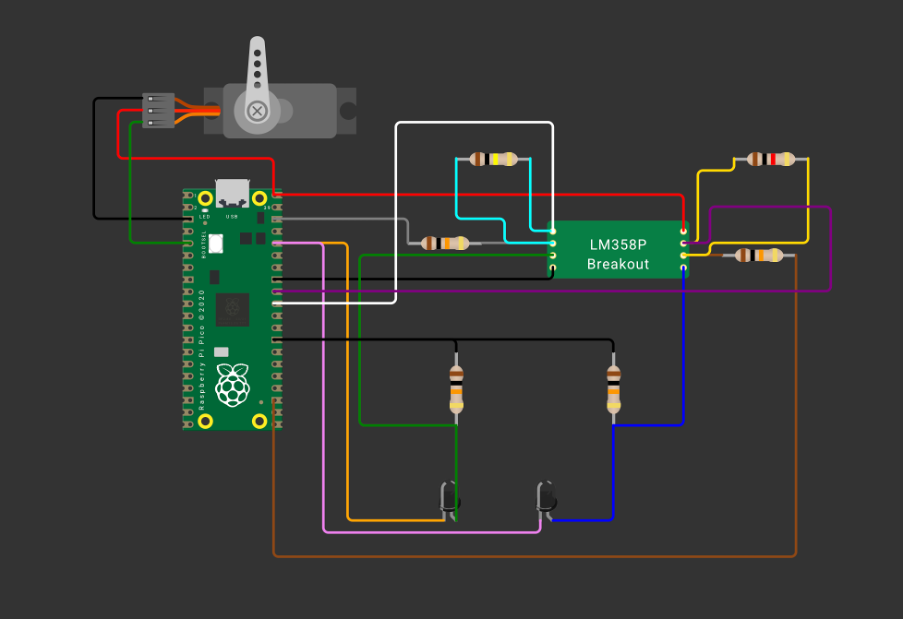

# SunflowerBot
**A mechatronic system for active light source tracking.**

Developed by **Danilov Alexandru** (325CA) as a DEEA Project.

### Images:

    
    

 

    
    

### Demonstration:
Please download the video to view the demonstration:
[Download Video](./media/video.mp4)
---

## 1. General Description
The **Sunflower Bot** is a proof-of-concept mechatronic system inspired by the heliotropism of sunflowers. Unlike static solar panels that lose efficiency during the morning and evening, this device actively tracks the light source on the horizontal axis to maximize light capture efficiency.

The system operates as a **closed-loop control system**. It uses a Raspberry Pi Pico to analyze the signal difference between two optical sensors separated by a physical partition. If an imbalance is detected, the system commands a servomotor to rotate the platform until the sensors are equally illuminated and the "error" is eliminated.

---

## 2. Functionality & Logic
The robot uses a **"bang-bang" algorithm**:
* **Tracking:** If the left sensor detects higher intensity than the right (above a specific threshold), the robot rotates left, and vice versa.
* **Equilibrium:** When the difference is minimal, the robot enters a rest state.
* **Energy Saving:** An "Idle" function prevents motor movement if the overall light level is too low (darkness).
* **Plug-and-Play:** Once the 2S LiPo battery is connected, the tracking starts automatically.

---

## 3. Hardware Components
* **Microcontroller:** Raspberry Pi Pico (RP2040) - The "brain" of the system.
* **Sensors:** Photodiodes (IR/Vis) - Convert light into electrical current.
* **Signal Conditioning:** LM358P Operational Amplifier - Amplifies the weak photodiode signal (approx. 11x gain) for the Pico's ADC.
* **Actuator:** MG995 Servomotor - High-torque metal gear servo for horizontal rotation.
* **Power Management:** LM2596 Buck Converter - Steps down the 2S LiPo voltage (7.4V - 8.4V) to a stable 5V.
* **Battery:** 2S LiPo - Portable power source.

---

## 4. Technical Simulations
The analog signal processing stage was simulated using **LTSpice** to validate the design.

### DC Sweep Analysis
The simulation confirms that the photodiode current is linearly converted and amplified. With a gain of 11x, a $10\mu A$ input results in a $1.1V$ output, ideal for the RP2040 ADC.

### Transient Analysis (Dynamic Regime)
The dynamic simulation shows that the amplification occurs almost instantly, ensuring the robot can react to light changes without significant delays.

---

## 5. Assembly & Wiring
The visual wiring diagram was created using Wokwi.

*(Note: The diagram above is for visual reference of the connections.)*

---

## 6. Manufacturing & Scaling
The current design is optimized for modularity, but for mass production, several improvements are possible:
* **PCB Integration:** Moving from modules to a single dedicated PCB to eliminate weak wire connections.
* **Power Source:** Replacing LiPo batteries with standard 18650 Li-Ion cells for better safety and cost.
* **Chassis:** Transitioning from 3D printing to injection molding for the plastic components.